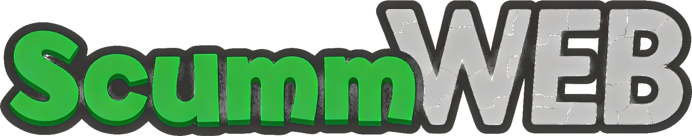

<div align="center">
  

  # ScummVM Web

  Browser launcher for installed ScummVM web targets, packaged with ScummVM's upstream Emscripten build.

  Next.js app for serving a prebuilt ScummVM WebAssembly bundle and booting directly into detected launcher targets such as `sky` and `dreamweb`.
</div>

## ✨ Features

- ScummVM-styled launcher UI that renders every detected ScummVM target from the generated bundle metadata
- Build pipeline that clones ScummVM, downloads the matching emsdk, and compiles a web target with the `sky` and `dreamweb` engines enabled
- Local game payload ingestion from `downloads/bass-cd-1.2.zip` plus an optional `downloads/dreamweb*.zip` archive into the generated browser bundle
- Archive-based asset flow: generated ScummVM web files are stored in `bundle/scummvm-public.zip` and restored into `public/` for `dev`, `build`, and `start`
- Compliance surface that keeps `source.html`, `source-info.json`, bundled license texts, and bundled game readmes accessible from the launcher
- Playwright-based smoke verification that launches the Next.js app, checks the rendered launcher targets, and boots each detected ScummVM target

## 🏗️ How It Works

1. **Build ScummVM**: `scripts/build_bass_web.sh` clones `vendor/scummvm` if needed, installs the matching emsdk, and runs the upstream Emscripten build with the configured engines.
2. **Install Game Data**: The script unpacks `downloads/bass-cd-1.2.zip` and any matching `downloads/dreamweb*.zip` archive into ScummVM's web build directory, then lets ScummVM detect installed targets.
3. **Stamp Compliance Metadata**: `game.json`, `games.json`, `source-info.json`, and `source.html` are generated alongside ScummVM's bundled docs and game files.
4. **Archive the Bundle**: `npm run archive:scummvm-bundle` captures the generated public assets into `bundle/scummvm-public.zip`.
5. **Serve the Launcher**: `npm run dev`, `npm run build`, and `npm run start` restore that archive into `public/` and expose a Next.js launcher that links to every detected `/scummvm.html#<target>`.

The launcher shell lives in [`app/page.js`](app/page.js), the CTA component lives in [`app/launch-button.js`](app/launch-button.js), and the heavy lifting for asset generation lives in [`scripts/build_bass_web.sh`](scripts/build_bass_web.sh) plus [`scripts/prepare_scummvm_bundle.sh`](scripts/prepare_scummvm_bundle.sh).

## 🚀 Getting Started

### Prerequisites

- macOS with `git`, `curl`, `python3`, `clang`, `make`, and `unzip`
- [Node.js](https://nodejs.org/) and npm for the Next.js shell
- `downloads/bass-cd-1.2.zip` present in this repo
- Optional DreamWeb archive copied into `downloads/` with a filename matching `dreamweb*.zip`
- A local Chrome or Chromium install if you want to run the Playwright verification script

### Setup

```bash
git clone https://github.com/tsilva/scummvm-web.git
cd scummvm-web
npm install
./scripts/build_bass_web.sh
npm run archive:scummvm-bundle
npm run dev
```

Open [http://localhost:3000](http://localhost:3000).

Run the main verification flow:

```bash
./scripts/verify_bass_web.sh
```

That script rebuilds the Next.js app, serves it locally on `127.0.0.1:3000`, launches Chromium through Playwright, verifies the launcher tiles, boots each detected target, and writes a screenshot to `artifacts/verify-launch.png`.

## ⚙️ Environment Variables

No runtime environment variables are required for the local launcher flow.

| Variable | Required | Description |
|----------|----------|-------------|
| `EMSDK_VERSION` | No | Overrides the emsdk version detected from ScummVM's upstream Emscripten build script during `scripts/build_bass_web.sh` |

## ☁️ Deploy to Vercel

This repo deploys like a standard Next.js app as long as `bundle/scummvm-public.zip` is present at build time, because `prebuild` restores the archived ScummVM assets into `public/`.

If you regenerate the ScummVM bundle locally, run `npm run archive:scummvm-bundle` before deploying so the committed archive matches the launcher shell.

```bash
# Preview deployment
vercel deploy -y

# Production deployment
vercel deploy --prod -y
```

## 🛠️ Tech Stack

- [Next.js](https://nextjs.org/) 13.5
- [React](https://react.dev/) 18
- JavaScript with the App Router file layout
- [playwright-core](https://playwright.dev/)
- [ScummVM](https://www.scummvm.org/) 2.9.1
- [Emscripten](https://emscripten.org/)
- [Vercel](https://vercel.com/)

## 📁 Project Structure

```text
app/
├── layout.js
├── launch-button.js
├── globals.css
└── page.js
bundle/
└── scummvm-public.zip
downloads/
├── bass-cd-1.2.zip
└── dreamweb*.zip
scripts/
├── archive_scummvm_bundle.sh
├── build_bass_web.sh
├── prepare_scummvm_bundle.sh
├── verify_bass_web.sh
└── verify_game_launch.mjs
public/
├── game.json
├── games.json
├── source-info.json
├── source.html
└── scummvm.html
vendor/
└── scummvm/
```

## 📝 Notes

- `predev`, `prebuild`, and `prestart` all run `prepare:scummvm-bundle` to restore managed ScummVM assets from `bundle/scummvm-public.zip`.
- The launcher reads detected game entries from `public/games.json` and keeps `public/game.json` as the primary-entry fallback.
- `source-info.json` records the project and vendored ScummVM revisions used to generate the bundle, including dirty-worktree flags.
- Verification depends on a local Chrome or Chromium binary because the repo uses `playwright-core` rather than the full Playwright browser download.

## 📄 License

This repo does not currently ship a separate top-level license file. Runtime distribution materials expose the relevant upstream notices and source-offer documents through `public/doc/`, `public/source.html`, and bundled game readmes under `public/games/` after bundle extraction.
